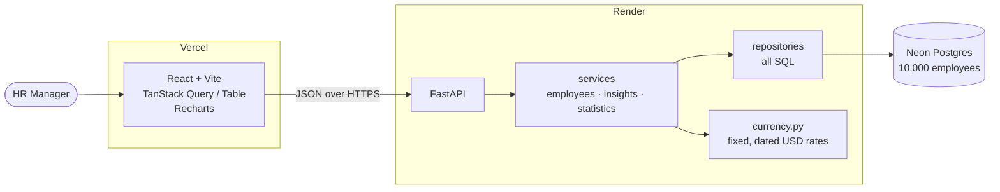

# ACME Salary Management

A web app that replaces the HR team's salary spreadsheets. One HR Manager can manage 10,000 employees across 8 countries and answer **how does ACME pay its people?** without building a pivot table.

| | |
| --- | --- |
| **Live app** | https://acme-salary-mu.vercel.app |
| **API docs** | https://acme-salary-api-8sqy.onrender.com/docs |
| **Demo video** | _link added after recording_ |

> **The API runs on Render's free tier.** After 15 minutes idle it sleeps, and the first request takes 30–60 s to wake it. The app shows a "Waking up the server" notice while that happens. Everything is fast after that.

## What it does
- **Employee directory:** search by name, email, or code. Filter by country, department, or title. Sort by name or salary, with pages and a shareable URL for every view.
- **Manage employees:** add, edit, and delete, with inline validation that matches the API (positive salary, supported country, unique email).
- **Two currencies per salary:** each salary shows the local amount ("2,450,000 INR") plus a USD equivalent. Sorting by salary uses USD, so cross-country lists are honest.
- **Pay insights:** headcount, total payroll, and median in USD. Min, median, average, and max by country, department, or title. Local currency is available when grouping by country.
- **Salary distribution:** a histogram for the whole org (USD) or one country (local currency).
- **Pay outliers:** employees more than 25% above or below the median for their **title and country**, so like is compared with like.

## Architecture



The layers are `api → services → repositories → models`, and each one only calls the one below. Routers stay thin, all SQL lives in repositories, and every currency conversion goes through `currency.py`. Local dev and tests use SQLite, and production uses Postgres. The only difference is `DATABASE_URL`.

## Key decisions
The full reasoning, including what I rejected, is in [`docs/DECISIONS.md`](docs/DECISIONS.md). The short version:

| Choice | Why |
| --- | --- |
| Store local currency, report in local or USD (D-003) | Local pay is the truth. Fixed, dated rates keep reports and tests deterministic. |
| Money as integers (D-004) | No float drift. The one scoped exception is sort ordering. |
| Postgres in prod, SQLite locally (D-005) | Render's free disk is wiped on restart, so SQLite there would lose every edit. |
| All salary aggregates computed in Python from one query (D-006) | Converting first, then aggregating (D-016), can't be done in SQL without floats. Fine at 10k rows. |
| Outliers by title and country median, strict > 25% (D-008) | Compares like with like. A z-score means nothing to HR. |
| ~1% planted outliers in the seed (D-009) | Uniform in-band data barely crosses 25%, so the feature would show no real signal. |
| Summary is USD-only (D-016) | Totals across currencies only mean something in one currency. |
| The API serves the country→currency map (D-017) | The frontend never keeps its own copy. |

**Deliberately left out:** auth, salary history, live FX rates, payroll and tax, Excel import. The reasoning is in [`docs/REQUIREMENTS.md`](docs/REQUIREMENTS.md).

## Run it locally
**Prerequisites:** Python 3.12, [uv](https://docs.astral.sh/uv/), Node 22

```bash
# backend (terminal 1)
cd backend
uv sync
uv run python -m seed.seed          # 10,000 employees, deterministic (seed 42), ~0.3 s
uv run uvicorn app.main:app --reload
# API at http://localhost:8000, docs at /docs

# frontend (terminal 2)
cd frontend
npm install
npm run dev                         # reads VITE_API_URL from .env.development
# UI at http://localhost:5173
```

## Tests
```bash
cd backend && uv run pytest -q && uv run ruff check .    # 176 tests, includes the code-limits check
cd frontend && npx vitest --run && npx tsc --noEmit      # 95 tests
```
Tests need no network and no external database, and they give the same result every run. A global guard fails any frontend test that makes an unmocked request.

## Performance (10,000 rows)
| Endpoint | Local (SQLite) |
| --- | --- |
| Search `GET /api/employees?search=smith` | 9 ms |
| Pay by title `GET /api/insights/by-dimension?dimension=job_title` | 20 ms |
| Outliers `GET /api/insights/outliers` | 84 ms |
| Seed 10,000 rows | 0.24 s |

Indexes cover `country`, `department`, `job_title`, and `email`. Page size is capped at 100, so the browser never receives the full table.

## How this was built
- **Strict TDD.** Every feature has a `test(...)` commit, with the failing run shown, before its `feat(...)` or `fix(...)` commit. PRs are merged with merge commits, never squashed, so that history survives.
- **AI-assisted, human-steered.** Claude Code wrote the code under the rules in [`CLAUDE.md`](CLAUDE.md), stopping at every red and green step. I reviewed each step and made every commit myself. What I accepted, overruled, or caught is in [`docs/AI_LOG.md`](docs/AI_LOG.md).
- **Every agent session recorded** with [The Session](https://www.npmjs.com/package/@vedantzz/session), a CLI I built and published. Each receipt compares the files I declared up front with what the agent actually changed. Receipts are in [`docs/sessions/`](docs/sessions/).

| Branch | Turns | API calls | Tokens |
| --- | --- | --- | --- |
| Setup | 1 | 32 | 2.06M |
| Employees API | 17 | 65 | 8.78M |
| Pay insights | 9 | 38 | 3.07M |
| UI: employees | 21 | 121 | 20.71M |
| UI: insights | 2 | 23 | 2.02M |
| Seed outliers | 4 | 19 | 1.10M |
| Deploy | 5 | 15 | 0.82M |
| **Total** | **59** | **313** | **38.56M** |

Token counts are pooled as The Session prints them, and they're mostly cache reads, not fresh input. The UI employees branch alone used over half, because of its many small red/green and fix cycles. Scope drift was only recorded reliably on the employees API branch, and the AI log explains why.

## Project docs
| File | What's in it |
| --- | --- |
| [`docs/REQUIREMENTS.md`](docs/REQUIREMENTS.md) | One-page requirements: goal, scope, what's out and why |
| [`docs/DECISIONS.md`](docs/DECISIONS.md) | Every design decision with rejected alternatives |
| [`docs/SPRINT.md`](docs/SPRINT.md) | The original sprint plan |
| [`docs/PROMPTS.md`](docs/PROMPTS.md) | The prompt cycle given to the agent |
| [`docs/AI_LOG.md`](docs/AI_LOG.md) | Where AI helped, where I overruled it, session data |
| [`docs/sessions/`](docs/sessions/) | One receipt per branch |
| [`CLAUDE.md`](CLAUDE.md) | The rules the coding agent follows |

## What I'd build next
1. **Excel import with a row-level validation report.** That's how HR's real data actually gets in.
2. **Salary history** (a `salary_changes` table) to answer "how has pay moved?"
3. **Auth and an audit log** once there's more than one user.
4. **Weighted seed distribution.** Today every country has about 1,250 people, which looks synthetic.